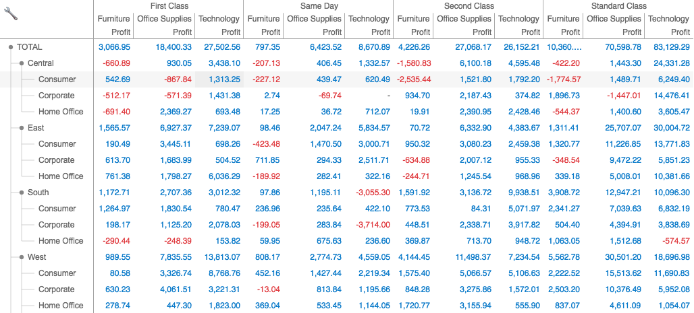
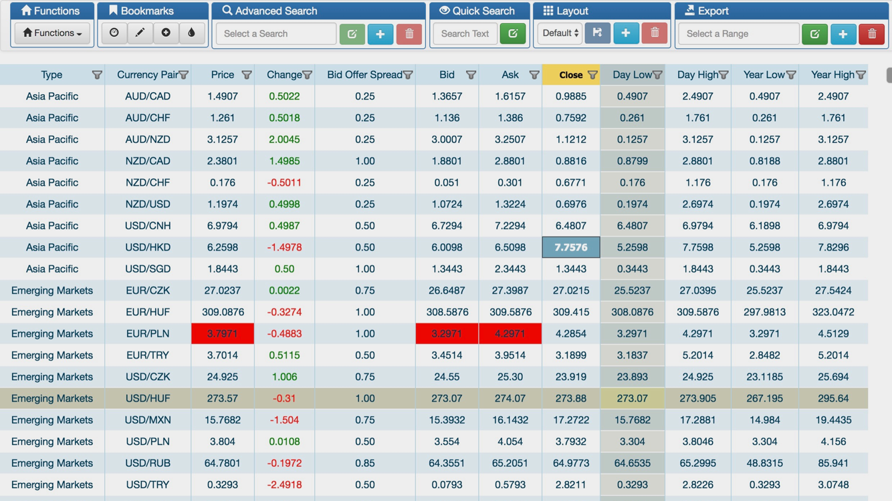

**fin-hypergrid** is an ultra-fast HTML5 grid presentation layer, achieving its speed by rendering (in a canvas tag) only the currently visible portion of your (virtual) grid, thus avoiding the latency and life-cycle issues of building, walking, and maintaining a complex DOM structure. Please be sure to checkout our [design overview](OVERVIEW.md)

Below is an example custom application built on top of the Hypergrid API tooling.
It also highlights a DOM-based custom external editor triggered via hypergrid events as well as interaction with Hypergrid's column ordering API

## Table of Contents
* [Current Release](#current-release-302---25-September-2018)
* [Distribution](#distribution)
* [Demos](#demos)
* [Features](#features)
* [Testing](#testing)
* [Documentation](#developer-documentation)
* [Roadmap](#roadmap)
* [Contributing](#contributors)

### Current Release (3.0.3 - 25 September 2018)

**Hypergrid 3.0 includes a revised data model with some breaking changes.**

_For a complete list of changes, see the [release notes](https://github.com/fin-hypergrid/core/releases)._

### Distribution

#### npm module _(recommended)_
Published as a CommonJS module to npmjs.org.
Specify a <a href="https://semver.org/">SEMVER</a> of `"fin-hypergrid": "3.0.3"` (or `"^3.0.3"`) in your package.json file,
issue the `npm install` command, and let your bundler (<a target="webpack" href="https://webpack.js.org/">wepback</a>,
<a target="browserify" href="http://browserify.org/">Browserify</a>) create a single file containing both Hypergrid and your application.

#### Build files _(for small and informal examples and proofs-of-concept)_
Also published as pre-bundled build files (`fin-hypergrid.js` and `fin-hypergrid.min.js`) to the GitHub CDN.
See the [CDN index](https://fin-hypergrid.github.io#index) for links.

Contains a JavaScript [IIFE](https://en.wikipedia.org/wiki/Immediately-invoked_function_expression)
that creates (as needed) the global namespace `window.fin` and populates `window.fin.Hypergrid`.
Your application would load one of these pre-bundled build files (in a `<script>` tag),
plus each of its own modules (or a single bundled build of all of its own its own modules).

### Demos

_The [`fin-hypergrid/build`](https://github.com/fin-hypergrid/build) repo generates the build files.
It also hosts the demo source files that test and show off various Hypergrid features.
Some of these use the npm module while others use the bundled build file.
Working versions of all demos are published to the CDN ([list of links](https://fin-hypergrid.github.io#demos))._

#### Testbench

The [default](https://fin-hypergrid.github.io/core) demo is the Hypergrid [dev testbench](https://fin-hypergrid.github.io/core/demo/index.html) ([source](https://github.com/fin-hypergrid/build/tree/master/testbench)).

(This app bundles the npm module plus all of its own modules together into a single file (`testbench.js`).
For illustrative purposes, [this alternate version](https://fin-hypergrid.github.io/core/demo/hypermods.html) loads
the pre-bundled build file `fin-hypergrid.js` plus specially IIFE-wrapped versions of each its own modules discretely.)

#### Simple example

See `example.html` for a very simple example ([repo](https://github.com/fin-hypergrid/build/blob/master/demo/example.html), [demo](https://fin-hypergrid.github.io/core/demo/example.html)):

#### Who else is using Hypergrid?

##### Perspective

The [Perspective](https://github.com/jpmorganchase/perspective) open source project uses Hypergrid v3 (demo links in the README) and does a lot more than Hypergrid alone, such as table pivots and charting.

##### AdaptableBlotter.JS

[Openfin](http://openfin.co)'s AdaptableBlotter.JS ([installer](https://install.openfin.co/download/?fileName=adaptable_blotter_openfin&config=http://beta.adaptableblotter.com/app-beta.json)) is a demo app that shows the capabilities of both Openfin and Hypergrid.

### Features

### Testing

Please use github [issues](https://github.com/fin-hypergrid/core/issues/new) to report problems

We invite everyone to test the alpha branch for changes going into the next release

Find more information on our [testing page](TESTING.md)

### Developer Documentation

Primarily our tutorials will be on the [wiki](https://github.com/fin-hypergrid/core/wiki).

We also maintain versioned [online API documentation](https://fin-hypergrid.github.io/core/2.1.15/doc/Hypergrid.html) for all public objects and modules. This documentation is necessarily an on-going work-in-progress.

(Cell editor information can be found [here](https://github.com/fin-hypergrid/core/wiki/Cell-Editors).)

(Cell Rendering information can be found [here](https://github.com/fin-hypergrid/core/wiki/Cell-Renderers).)

Hypergrid global configurations can be found [here](https://fin-hypergrid.github.io/core/2.1.15/doc/module-defaults.html).

### Roadmap

For our current queue of up coming work you can find it [here](ROADMAP.md)

### Contributors

Developers interested in contributing to this project should review our [contributing guide](CONTRIBUTING.md) before making pull requests.
